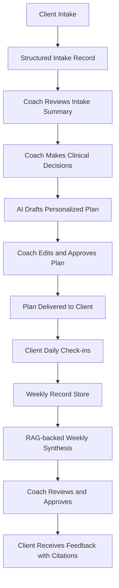

# Coach OS

A workflow operating system for nutrition and lifestyle coaching.

Coach OS replaces a fragile stack of Excel sheets, PDFs, WhatsApp threads, and manual weekly reviews with a structured coaching system built for high-trust, longitudinal care. It combines adaptive intake, coach-led plan generation, flexible client tracking, evidence-backed weekly reviews, and AI assistance with mandatory human approval.

**Core principle:** the system should increase clinical leverage without making the client experience feel cold, obsessive, or over-quantified.

---

## Current Status

**Stage:** product design complete, implementation in progress

| Status | What |
|--------|------|
| Implemented | Project scaffolding, data model, auth (coach + client roles), intake form with conditional branching and save/resume, coach review surfaces |
| In progress | Intake streamlining, plan generation workflow |
| Planned | Tracker templates, weekly review with RAG citations, client dashboard modes, voice input, wearable integrations |

This README describes the intended product architecture and design principles. Not all systems described below are implemented yet.

---

## System Overview



---

## Why This Exists

Most independent coaches and small practices run their workflow across spreadsheets, PDFs, chat threads, and memory. That creates three problems:

1. **Client drop-off at intake.** Long, spreadsheet-based assessments are intimidating and easy to abandon.
2. **High manual effort for plan creation.** Translating intake data into a personalized coaching plan takes 8-10+ hours per client.
3. **Review fatigue at scale.** Weekly tracking and feedback are valuable, but become operationally expensive as the client base grows.

Coach OS preserves clinical depth while reducing administrative drag. It does not replace the coach. It gives the coach better infrastructure.

---

## User Roles

### Coach
- Reviews intake data and clinical summary
- Makes all clinical decisions (calorie targets, macros, approach, referrals)
- Edits AI-drafted plans before delivery
- Approves weekly reviews before clients see them
- Configures dashboard mode per client based on clinical judgment

### Client
- Completes adaptive intake assessment
- Logs daily check-ins (< 2 minutes, mobile-first)
- Views personalized plan and weekly feedback
- Sees progress through a coach-configured dashboard

### System
- Structures and stores intake data
- Generates clinical summaries with red-flag detection
- Drafts plans and weekly reviews from structured data
- Attaches citations to every claim in weekly synthesis
- Never sends clinical output without coach approval

---

## Design Philosophy

When self-improvement becomes a KPI dashboard, wellness stops feeling like care and starts feeling like surveillance. Coach OS is designed to avoid that trap.

### 1. The client experience should feel human
Daily check-ins should feel like texting your coach, not submitting a performance report. No red/green adherence color coding. No guilt-inducing banners. The system tracks data quietly in the background — the client-facing experience should feel warm, not clinical.

### 2. The coach stays in control
AI can summarize, draft, and organize. The coach makes clinical decisions and approves every client-facing output. The client should always feel they're hearing from their coach, not from software.

### 3. Progress is broader than metrics
Behavioral wins, consistency, and emotional context matter alongside weight, macros, and adherence. The plan already embodies this — introductory remarks talk about resilience, self-forgiveness, and realistic expectations. The app should match that tone.

### 4. The system should know when not to intervene
A missed check-in is not a failure — it's a data point. If a client goes quiet, the system flags it for the coach rather than bombarding the client with reminders. The coach decides how to re-engage, not the algorithm.

### 5. Dashboard intensity is a clinical choice
Some clients benefit from data-heavy views — seeing their weight trend and macro adherence motivates them. Others would be harmed by it, especially clients with addictive or obsessive tendencies (which the intake explicitly screens for). The coach choosing minimal vs. standard vs. data-heavy mode per client is not a UX preference — it is a clinical judgment call about what is psychologically safe for that specific person.

---

## Product Architecture

### 1. Intake System
A continuous, multi-section intake flow with conditional branching, save-and-resume, and voice input for narrative responses. Branching reduces visible questions by ~30-40% for clients without certain conditions, while preserving full clinical depth for complex cases.

### 2. Plan Generation System
Combines structured intake data, coach decisions, and AI-assisted drafting to produce personalized plans without removing coach oversight.

1. Auto-generated intake summary with red-flag extraction
2. Coach decision layer (calorie target, macros, approach, pacing, referrals)
3. AI-assisted draft generation
4. Section-by-section coach review and editing
5. PDF export and client delivery

### 3. Tracking and Weekly Review System
Each client gets a plan-specific tracker and a lightweight daily check-in flow. Weekly reviews synthesize the client's actual records and generate coach-editable feedback with citations to underlying check-in data. Every claim in the weekly synthesis is traceable to specific dates, fields, and values.

---

## AI Safety and Boundaries

Coach OS is a clinical support system, not an autonomous clinical actor.

- AI-generated plans are drafts, not final recommendations
- The coach approves all client-facing outputs
- The system does not make referral or diagnosis decisions independently
- Red flags are surfaced for coach review, not automatically acted upon
- Every claim in weekly synthesis is backed by citations to source data
- Client data is anonymized before AI processing
- Intake includes explicit consent for AI-assisted plan generation

---

## Tech Stack

| Layer | Choice |
|---|---|
| Framework | Next.js 15 (App Router) + PWA |
| Database | PostgreSQL + Prisma |
| Auth | NextAuth.js (coach + client roles, row-level security) |
| AI (heavy) | Claude Code scripts for plan drafting and weekly synthesis |
| AI (light) | Groq Llama 3.3 70B for intake summaries and red-flag detection |
| Voice | Groq Whisper Large v3 Turbo |
| Hosting | Vercel + Supabase |
| PDF Export | react-pdf or Puppeteer |
| Email / Nudges | Resend |
| Wearables | Fitbit + Google Fit APIs |

---

## Roadmap

1. **Foundation + Intake** — Project scaffolding, data model, intake form, coach review view
2. **Plan Generation** — Intake summary, coach decision form, AI plan drafting, PDF export
3. **Tracker + Daily Check-Ins** — Flexible templates, mobile check-in form
4. **Weekly Review + RAG Citations** — Citation engine, weekly synthesis, coach approval workflow
5. **Client Dashboard** — Configurable (minimal/standard/data-heavy), progress views, weekly review timeline
6. **Voice Input + Proactive Nudges** — Groq Whisper transcription, rule-based nudges
7. **Wearable Integration** — Fitbit, Google Fit auto-sync
8. **Polish + Security** — Coach dashboard, mobile responsiveness, security scanning

---

## Getting Started

```bash
npm install
npx prisma generate
npm run dev
```

This repository is under active development. The README reflects the intended product architecture; some systems are still being implemented.

---

## Vision

Coach OS is not trying to automate care. It is trying to give coaches better infrastructure so they can deliver more thoughtful care, more consistently, with less administrative drag.

## License

MIT
